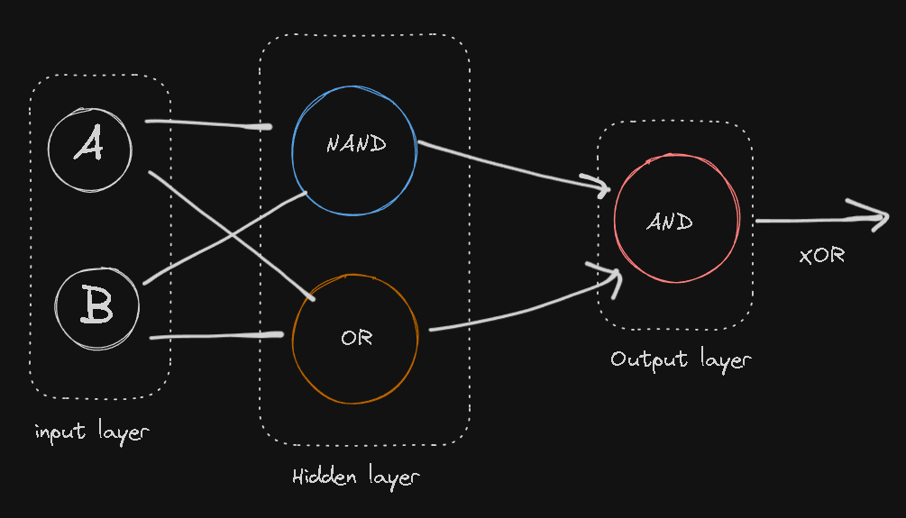
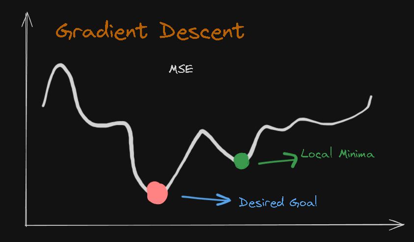

# Neural-Network-CPP
Neural Network implementation in C++

## To run the process untill now
To run the Logic Gate Tester  
`g++ logicGateTester.cpp header/MLPerceptrons.cpp -o logicGateTester -I./header`  
`g++ NeuralNetwork.cpp header/MLPerceptrons.cpp -o main -I./header`

## Creating XOR using Multilayer Perceptrons
Logic behind:

## Error Function
